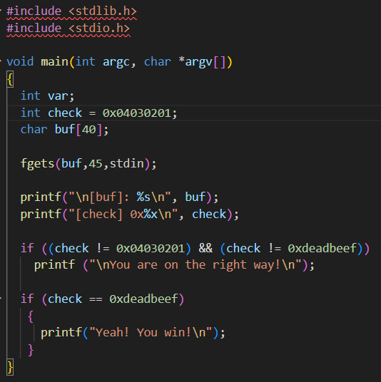
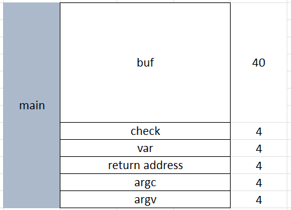
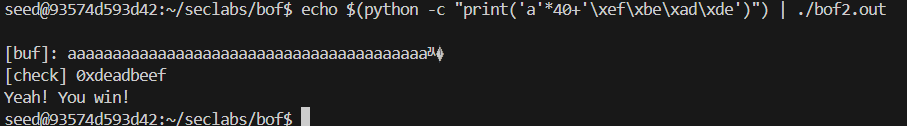

trong chương trình, ta thấy có lỗ hổng buffer overflow tại hàm fget khi biến buf có kích thước là 40 bytes trong khi fget có thể đọc tới 45 bytes, vì thế người dùng có thể nhập dữ liệu nhiều hơn 40 bytes để có thể ghi đè lên các bytes lân cận

đây là bản vẽ stack của chương trình, mục tiêu của ta là thay đổi biến check sao cho giá trị phải khác giá trị được gán ban đầu là 0x04030201 và bằng giá trị được đưa 0xdeadbeef

chạy chương trình 

`echo $(python -c "print('a'*40+'\xef\xbe\xad\xde')") | ./bof2.out`
- dùng echo ... | ./bof2.out : để chuyển kết quả đầu ra của eco làm đầu vào cho chương trình
- nhập 40 ký tự a và giá trị 0xdeadbeef bằng python

kết quả:

