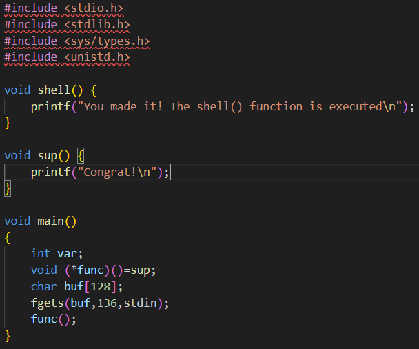
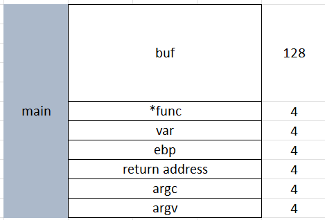
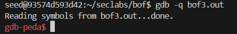
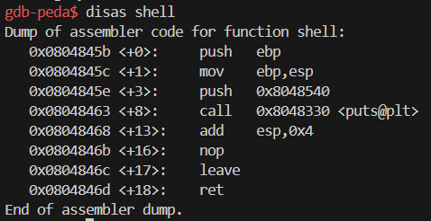
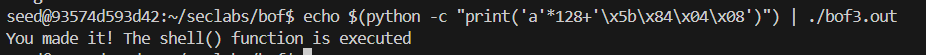

Chương trình này, ta thấy được biến buf có kích thước 128 byte, nhưng hàm fgets cho phép đọc 136 byte, nên là có thể ghi quá giới hạn của biến buf và ghi đè các giá trị nằm sau nó trong bộ nhớ, dẫn tới buffer overflow

Đây là bản vẽ stack, ta thấy được nếu nhập nhiều hơn 128 byte, các byte tiếp theo sẽ ghi đè giá trị của func, từ đó có thể thay đổi giá trị của con trỏ hàm để trỏ tới hàm shell.

Debug chương trình

Tìm địa chỉ của hàm shell()

=> Địa chỉ hàm shell: 0x0804845b

Chạy chương trình

`echo $(python -c "print('a'*128+'\x5b\x84\x04\x08')") | ./bof3.out`

Kết quả:

