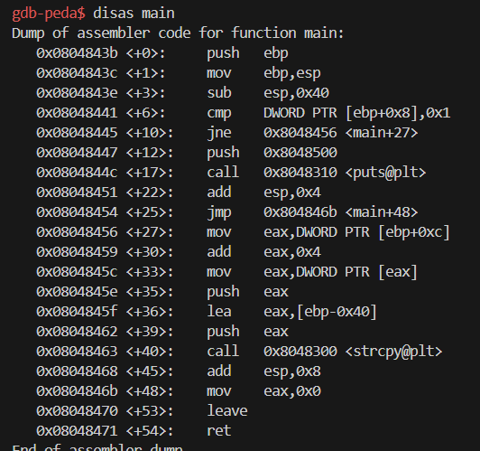
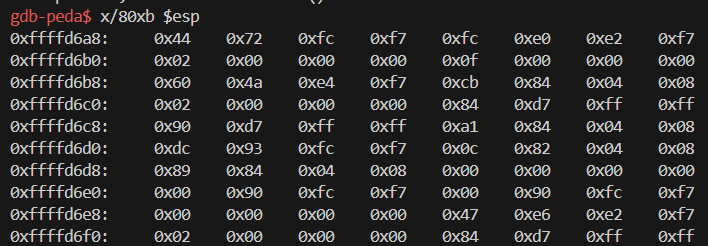

# 1. Injection code to delete file via vuln.c

Mục tiêu là thay đổi giá trị trở về của hàm main sao cho có thể chạy shellcode

### Shellcode

#### 1. Viết chương trình shellcode bằng hợp ngữ, biên dịch (nasm) và liên kết (ld) để tạo chương trình thực thi

`nasm -g -f elf sh.asm `

`ld -m elf_i386 -o sh sh.o`

#### 2. dùng objdump -d sh để xem mã nhị phân của file sh

Dùng câu lệnh này để chỉ lấy các mã nhị phân của file sh và in ra

=> 27 bytes của shellcode

### Chuẩn bị môi trường lab

- Tắt chế độ cấp phát địa chỉ stack ngẫu nhiên khi load chương trình của HĐH

- 

- Biên dịch chương trình c với các option tắt cơ chế bảo vệ stack và cho phép thực thi code trên stack

* "-z execstack: "cho phép thực thi code trên stack"

- Creat link to zsh instead of default dash to turn off bash countermeasures of Ubuntu 16.04
  

* Phiên bản 16.04 có cơ chế bảo vệ stack => tắt đi => tạo shell mới zsh cho phép thực thi

### CONDUCTING THE ATTACK

Mục tiêu là chèn 27 bytes của shellcode vào biến buf + 41 bytes bất kì

=> 68 bytes của buf + ebp

disas main

đặt breakpoint sau khi stackframe được thiết lập: 0x08048441

đặt breakpoint sau khi esp quay trở lại trí ban đầu: 0x0804846b

chạy chương trình

`r $(python -c "print('\x31\xc0\x50\x68\x2f\x2f\x73\x68\x68\x2f\x62\x69\x6e\x89\xe3\x50\x53\x89\xe1\x31\xd2\x31\xc0\xb0\x0b\xcd\x80'+'41'*a+'\xff\xff\xff\xff')")`

*'\xff\xff\xff\xff': dùng để nhận diện địa chỉ trả về của hàm main

xem bộ nhớ stack khi stackframe được thành lập

xem bộ nhớ stack sau khi đã chèn shellcode vào

* 27 bytes đầu là của shellcode

* 41 bytes a

* 4 bytes 0xff là return address

thay thế địa chỉ trả về của stack thành esp

bộ nhớ stack sau khi thay thế địa chỉ trả về của stack thành esp

chạy tiếp

